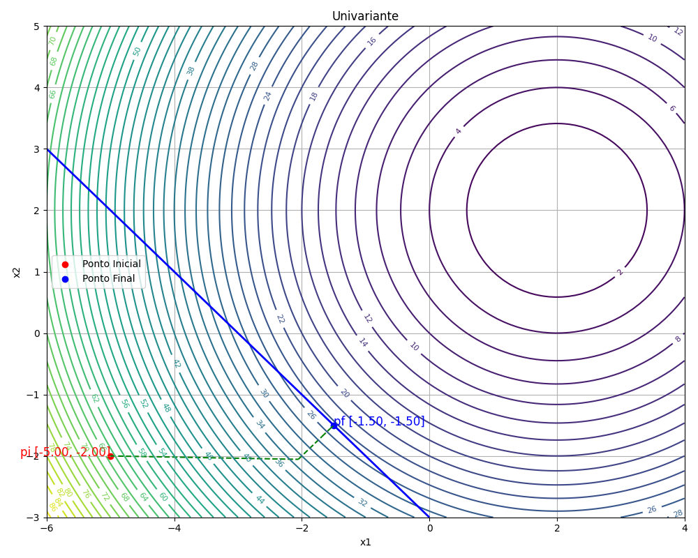
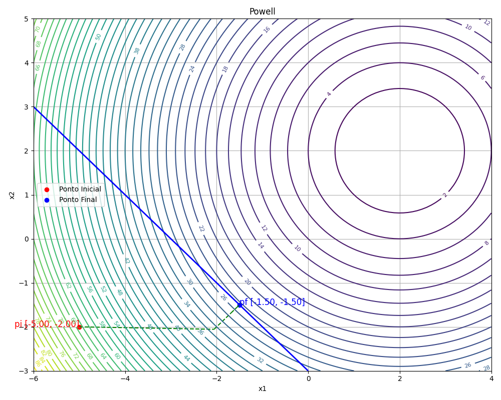

# Optimization

Biblioteca didática em Python para estudar e comparar métodos de otimização numérica em duas variáveis, com foco tanto em problemas sem restrições quanto em problemas com restrições tratados por penalidade e barreira. O projeto reúne rotinas de busca linear, minimização clássica, funções de teste e visualização da trajetória.

Este repositório foi organizado para apoiar atividades de disciplina e experimentos com superfícies 2D, por isso a maior parte das rotinas e gráficos assume pontos no plano \(x_1, x_2\).

## O que este projeto faz

O pacote `optimization/` implementa e organiza os seguintes blocos:

- busca linear por passo constante e seção áurea;
- métodos de minimização sem restrições;
- base experimental para otimização com restrições por penalidade e barreira;
- funções exemplo para testar algoritmos;
- gráficos de curvas de nível, superfícies e trajetórias;
- pequenos utilitários de álgebra linear e formatação no terminal.

A ideia principal é permitir que você forneça uma função objetivo, um ponto inicial e, quando necessário, gradiente e Hessiana, para então observar como cada método se comporta. Nos experimentos com restrições, o código transforma o problema original em uma sequência de problemas sem restrições e reaplica um método de minimização clássico a cada iteração.

## Métodos implementados

### Busca linear

- `passo_constante`: encontra um intervalo inicial para a busca em uma direção dada.
- `secao_aurea`: refina o melhor valor de passo dentro do intervalo.
- `bissecao`: versão auxiliar usada em estudos e scripts experimentais.
- `make_step`: aplica o deslocamento `p + alfa * d`.

### Métodos de minimização sem restrições

- `univariante`: alterna direções coordenadas em \(x\) e \(y\).
- `powell`: combina direções coordenadas e uma direção construída a partir do histórico.
- `steepest_descent`: usa a direção oposta ao gradiente.
- `fletcher_reeves`: variante conjugada baseada em gradientes sucessivos.
- `newton_raphson`: usa Hessiana para construir a direção de descida.
- `bfgs`: aproxima a inversa da Hessiana de forma iterativa.

Em todos eles, a busca linear é usada para escolher o tamanho do passo ao longo da direção de descida.

### Otimização com restrições

Os experimentos com restrições estão concentrados em `rascunhos/trabalho2.py`. A ideia é converter um problema com restrições em uma sequência de problemas sem restrições usando uma pseudo-função objetivo do tipo:

$$
f_i(x) = f(x) + \frac{1}{2} r \cdot p(x)
$$

onde `p(x)` agrega os termos das restrições.

- Na **penalidade**, violações de restrições são penalizadas por termos quadráticos, empurrando a solução para a região viável.
- Na **barreira**, o método impõe uma barreira interna para evitar sair da região viável, o que exige começar em um ponto interno e ajustar o parâmetro de barreira com cuidado.

O fluxo geral reaplica um método de minimização sem restrições em cada pseudo-problema e atualiza o parâmetro da estratégia escolhida até a convergência.

## Estrutura do pacote

- `optimization/minimize.py`: implementação dos algoritmos principais.
- `optimization/linear.py`: busca linear e passos ao longo de direções.
- `optimization/functions.py`: funções de teste, como McCormick e Himmelblau.
- `optimization/ploting.py`: gráficos de curvas de nível, superfície e trajetórias.
- `optimization/matrices.py`: pequenas rotinas auxiliares com vetores e matrizes.
- `optimization/colors.py`: cores ANSI para mensagens no terminal.
- `optimization/__init__.py`: atualmente vazio; as importações são feitas por módulo.
- `rascunhos/`: scripts de estudo, versões intermediárias, experimentos com restrições e notebooks.
- `imgs/`: imagens geradas para ilustrar os resultados dos métodos em um problema de otimização com restrição.

## Funções de teste

O arquivo `optimization/functions.py` traz exemplos prontos de funções objetivo para experimentação:

- `a`
- `lista1_4`
- `mc_cormick`
- `himmelblau`

Essas funções ajudam a comparar comportamento, velocidade e formato da trajetória de cada método.

## Imagens

As figuras abaixo apresentam um problema de otimização com restrição utilizando cada um dos métodos.

| Univariante | Powell | Steepest Descent |
|---|---|---|
|  |  |  |
| Fletcher Reeves | Newton Raphson | BFGS |
|  |  |  |

## Como usar em outros códigos

A forma mais comum de usar este pacote é importar o método desejado, fornecer a função objetivo e suas derivadas, e então decidir se deseja apenas o ponto mínimo ou também o caminho completo da iteração.

### Exemplo mínimo

```python
import numpy as np

from optimization.minimize import bfgs
from optimization.ploting import plot_curves
from optimization.functions import himmelblau


def grad_himmelblau(p: np.ndarray) -> np.ndarray:
    x1, x2 = p
    df_dx1 = 4 * x1 * (x1**2 + x2 - 11) + 2 * (x1 + x2**2 - 7)
    df_dx2 = 2 * (x1**2 + x2 - 11) + 4 * x2 * (x1 + x2**2 - 7)
    return np.array([df_dx1, df_dx2], dtype=float)


p0 = np.array([0.0, 0.0], dtype=float)

p_min, points = bfgs(
    p0=p0,
    func=himmelblau,
    f_grad=grad_himmelblau,
    alfa=0.01,
    tol_grad=1e-6,
    tol_line=1e-6,
    verbose=True,
    monitor=True,
)

print("Mínimo aproximado:", p_min)
plot_curves(points, himmelblau, title="Trajetória do BFGS", show_fig=True)
```

### O que cada parâmetro significa

- `p0`: ponto inicial.
- `func`: função objetivo.
- `f_grad`: gradiente da função.
- `f_hess`: Hessiana, quando o método exigir.
- `alfa`: passo inicial usado na busca linear.
- `tol_grad`: critério de parada pela norma do gradiente.
- `tol_line`: tolerância da busca linear.
- `n_max_steps`: número máximo de iterações.
- `verbose=True`: exibe progresso no terminal.
- `monitor=True`: retorna também a lista de pontos visitados.

### Assinaturas principais

```python
univariante(p0, func, f_grad, alfa, tol_grad, tol_line, n_max_steps=500, verbose=False, monitor=False)
powell(p0, func, f_grad, alfa, tol_grad, tol_line, n_max_steps=500, verbose=False, monitor=False)
steepest_descent(p0, func, f_grad, alfa, tol_grad, tol_line, n_max_steps=500, verbose=False, monitor=False)
fletcher_reeves(p0, func, f_grad, alfa, tol_grad, tol_line, n_max_steps=500, verbose=False, monitor=False)
newton_raphson(p0, func, f_grad, f_hess, alfa, tol_grad, tol_line, n_max_steps=500, verbose=False, monitor=False)
bfgs(p0, func, f_grad, alfa, tol_grad, tol_line, n_max_steps=500, verbose=False, monitor=False)
```

## Visualização

O arquivo `optimization/ploting.py` oferece funções para acompanhar as iterações:

- `plot_curves`: desenha curvas de nível e a trajetória dos pontos.
- `plot_surface`: mostra a superfície 3D da função.
- `plot_restriction_curves`: útil em problemas com restrições.
- `plot_figs` e `plot_images`: combinam figuras para comparação.

Isso é especialmente útil quando você quer comparar como métodos diferentes se movem até o mínimo.

## Observações importantes

- Algumas rotinas de plotagem e direções fixas de busca assumem exatamente duas variáveis.
- Os arquivos em `rascunhos/` servem como experimentos, estudos e versões de aplicação; eles ajudam a entender o uso dos métodos, mas não fazem parte da API principal.

## Dependências

O projeto usa principalmente:

- `numpy`
- `matplotlib`
- `sympy`

Se necessário, você pode instalar com:

```bash
pip install numpy matplotlib sympy
```
